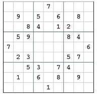

```{r setup, include=FALSE}
knitr::opts_chunk$set(echo = FALSE, warning = FALSE, message = FALSE, out.width = "80%", fig.align = "center")
knitr::read_chunk('meta-heuristics-assignment.R')
```

```{r library, eval = F}
```


# Introduction

Artifical Bee Colony (ABC) algorithm is a meta-heuristic optimization algorithm recently introduced by @Karaboga2005. It simulate the behaviour of a honey bee swarm in the attempt to find the optimal solution. As an general optimization algorithm, it does not limit to Clustering problem. We now give a brief overview of how the ABC algorithm works and summarize the algorithm in the pseudo-code that follows. Intruduction of each component in detail is given later in the clustering section. Part of the notation and formulations are adopted from @karaboga2011novel.


## Overview

Other than parameter initialization and solution evaluation, the ABC algorithm can be structured into three phases: the employed bee phase, the onlooker bee phase, and the scout bee phase. Each phase mimic the behavior of a group of bees in a honey bee swarm. 

At the beginning of the algorithm, the total number of food sources (the solution set) is to be determined and denoted as $SN$ (swarm size). The swarm size is one of the most important parameter in the ABC algorithm, as a large swarm size increases the accuarcy and decrease efficiency. We will dicuss the impact of swarm size in more detail in the parameter section.

After $SN$ being decided, the ABC algorithm will simulate the position of initial food sources. The way to simulate the food sources has been tailored in differnt problems in the literature: they can be evenly assigned across the solution space (@ABCoptim), randomly generated from a distribution (@karaboga2011novel), or they can be randomly selected from different data points for the problem of clustering. The main idea is to cover the solution space as much as possible.

The number of the employed bees or the number of the onlooker bees is the same as the swarm size, or to be specified by the user. In the employed bee phase, the bees search locally to find a neighbour, create a new solution by combining the existing solutions, then decide if to replace the current solution with the new solution using a greedy selection approach. The onlooker bee then performs similar neighbourhood search, the difference is the onlooker bee will search neighbours and create new solutions around existing solutions with better quality, so the onlooker bees provide a tendency towards where it is likely to produce good solution. The way that the employed bees and onlooker bees find neighbour and create new solutions, and the which solution that the onlooker bees select can be calculated using the general methods in the ABC algothim, or can be different depending on the problem at hand.

After the phases of the employed bee and onlooker bee, whether one solution has been improved is recorded for each food source. If one solution could not be improved up to some certain number of iteration, it will be discarded and the scout bees will find a replacement in the solution space to fill the postion, where the way to find new solutions can be independent with the current solutions. The employed bee and the onlooker bee search locally while the scout bee is in charge of the global search. In other words, the employed bee and the onlooker bee emphasis intensification by producing better solutions based on the current solution set, while the scout bee emphasis diversification search solutions independently from the current set of solutions. The ABC algorithm aims to chieve a balance between intensification and diversification through three different phases mimicing three different types of bee.


The updated solution in each iteartion is the best solution among all the food sources in that iteration, and the final solution chosen by the algorithm is the best solution among all the food sources tried in the past up until the time the condition is met. Stopping condition are required to determine when to stop the algorithm. @karaboga2011novel choose to use the maximum number of iteration as the stopping condition. @ABCoptim includes the number of umimproved iteration: the algorithm stops when the result does not improve up to a certain number.


The ABC algorithm can be summarized in the following pseudo-code.

```r
Algorithm: Artifical Bee Colony
 1. Load the training data
 2. Generate the initial food sources 1,2,...,SN
 3. Evaluate the quality of nectar (the fitness of initial solutions)
 4. While (Condition not met)
        The employed bee phase
 5.     For each employed bee{
          Produce new solution using neighbourhood search
          Calculate the fitness
          Selecte the better fitted solution Greedily }
 6.     Calculate the probabilities of selecting each solution
        The onlooker bee phase
 7.     For each onlooker bee{  
          Select a solution based on the probabiliy calculated above
          Produce new solution using neighbourhood search
          Calculate the fitness
          Selecte the better fitted solution Greedily }
 8.     Abandon the solution that the number of unimproved iteration reach the limit
        The scout bee phase
 9.       Increase the number of food source to SN by finding new solution randomly
10.     Record the best solution among all food sources
11. End

```


## The parameters

There are three parameeters in the ABC determines the quality of optimization and needs to be taken carefully: 1. the number of food sources (SN) which is also the number of empleyed bees or the onlooker bees; 2. the value of limit that decides when to abandon food sources; 3. the stopping conditions, such as the maximum cycle number (MCN) or the maximum number of unchanged iteration. 

The number of the employed bees, the onlooker bees, or the scout bees can also be customized based on the specified problem. As @karaboga2011novel emphsis the three parameters mentioned above, we will assume the number of the employed bees or the onlooker bees are the same as the swarm size $SN$ and assme the number of scout bees is one per iteration in the following discussion, which would be sufficent in general optimization problem. 

### The number of food sources (SN)

A large numer of food sources can increase the excution time for each iteration dramatically. It is the number of neighbourhood serach and greedy evaluation conducted in the employed bee phase or the onlooker bee phase. For each iteration, there is effectively $2\times SN$ neighbourhood search conducted by the employed bee and the onlooker bee. While a large $SN$ increase the time it needs to run for each iteration, it also means the local search is more throughly implemented: the number of solution we are consider at the same time is large. Therefore, there is a higher chance of finding a better solution.

### The limit

The limit controls the balance between intensification and diversification. If the limit is set to be too large, a useless food source needs more time to be droped and more time is needed to triger the global search implemented by the scout bee, which may leads to unnecessary intensification over diversification. If the limit is set to be too small, a promising food source may be droped before it runs the time it needs to produce a good solition, and the scout bee is trigered too early, leading to diversification more then intensification.

### The stopping condition

If we consider the maximum cycle number (MCN) as the stopping condition, a small value of the MCN may stops the algorithm too early then the optimization settles down to the optimal solution. If MCN is set to be too large, the algorithm may run many extral iterations without any improvement, leading to a poor efficiency. The maximum number of unchanged iteration works the same way: the algorithm may stops before the solution converges.


## Comparing to others and its own features

We compare the ABC algorithm to two other meta-heurtistics: The Simulated Annealing and the Genetic Algorithm. The ABC algorithm share some of the same features of other meta-heuristics while having its own technic to some of other problem. We now look at how the problem specific elements in those algorithms are presented in the ABC algorithm.

### Escape local optimum differently from Simulated Annealing

The simulated annealing differs from the basic neighbourhood by allowing the algorithm to accept a solution with worse fitness with certain probabilities. With such a feature that mimic the process of ammealing metals to climb the "hill" in the curve of objective function, it can escape the local minimum (when it is a minimization problem). The probability of accepting a worse move decreases with time. 

The ABC algorithm does not have the feature to accept a worse move if we consider the path of solution in ABC as the best solution among all the food soures in each iteration. However, it has a similar functionality to avoid being stucked in the local minimum: it abandons the food source that has not been improved for some certain amount of iteration. By droping unimproved food source, it effectively drops the solutions that are in the local minimum. By consider the all the food sources collectively and add in new food sources from the whole space, it expands its search spane.

### Reproduce like Genetic Algorithm (GA)

The genetic algorithm imitates the process of evolution. It selects multiple solutions (selection), create a new solution from those existing solutions (crossover), modify the solution to create another new solution (mutation), calculate the objective value of the new solution (evaluation) and determine whether to replace a existing solution using the new solution (update). 

Many components in the ABC algorithm largely share the same process in the genetic algorithm. The bees finding neighbours is corresping to selction in GA. Creating new solution using the neighbour is corresping to the crossover in GA. calculating the fitness of the new solution and deciding whether to take the new solution are corresping to evaluation and update. The differece is for the step of mutation. In GA, mutation is done separatly from crossover, but in ABC the mutation step is embeded in the crossover: after selecting a neighbour, the bee create the new solution not only based on the esisting ones, but also adding a random component. (The random number generation in Equation \@ref(eq:find-neighbour) which is to be discussed later.)

### Its own features

#### Additional global search

The scout bee phase in the ANC provides addtional global search that is lacked in both the simulated annealing and the genetic algorithm. Although the diversification can be achieved using different parameters in those two methods, using a sepeartly component generats certain exposure to the whole solution space.

#### Tendency towards better performed solution

The onlooker bees find the food sources with better quality and conduct seach aroud them: the create new solutions using good solutions. This improves the effeciency of the algorithm as intuitively good solutions may cluster together. Simiar feature can be found in come modified genetic algorithm. The way to select the parent solutions may be weighted towards good solutions.

# Applying the ABC Algorithm to Solve Sudoku Puzzles

@pacurib2009solving provides solution of Sudoku puzzles using the ABC algorithm. Sudoku puzzles is a logic-based combinatorial puzzle. Players are given a map of $n\times n$ squares (cells) with some of the squares filled with numbers called the starting squares. The player aims to fill out the rest of cells based on the following three rules

1. A number can only appear once in each row 
2. A number can only appear once in each column 
3. A number can only appear once in a $m\times m$ predifined sub-block.

Figure \@ref(fig:sudoku) is an example of $9\times 9$ sudoku puzzle with $3\times 3$ sub-blocks.

```{r sudoku, fig.cap = "An example of sudoku puzzle from Pacurib, J. A., Seno, G. M. M., and Yusiong, J. P. T. (2009, December)", fig.align="center"}

```

@pacurib2009solving apply the ABC algorithm by imposing the third constrain in the solution space while only evaluate objective function using the other two constrains in the algorithm. The solution representation would simply be a vector of numbers, where the position of the number corresponds to the index of the cell they are in. The optimization problem is to minimize the number of duplicate digits found on each row and column, while the third constraint is set to be always satistified for a valid solution.  

## The parameters specification

The number of food souces in the experiments of @pacurib2009solving is defined to be 100, the same as the number of the employed bees, while the number of onlooker bees to be set as 200. The number of scout bees is set to be 10% of the employed bees which is 10. The maximum number of iteration is set to be 100,000. 

In general ABC algorithm, the food sources are abondanded when the number that they does not change accumulates to the limit. In the Sudoku problem, the food sources are paired to a randonly generated new food source by the scout bee, and if new food source has a higher fitness than the old one, the old one is replaced, so the value of the limit is no long a parameter needed in this problem.

There are two stopping criteria. While the objective function is the number of duplicate digits, one of the criteria is having a fitness value of 1, If this criteria is met it means that the optimal solution to the puzzle has been found. If this criteria is not met, instead the algorithm stops when it reachs the maximum number of cycles, it means the algorithm has not yet find the optimal solution to the puzzel and it produced the best solution obtained at the time the algorithm stops. 

## Adjusted approach

The initial food sources are simulated by randomly place digits within the bounds in the cells which satisfying the third constaint. The approach of creating new solution is adjusted to fit this specific problem. Given the solution representation of a vector of digits, a random number $j$ is chosen for the feasible solution $X_i$ and the randomly chosen neighbor $X_k$. If we denote the new solution as $V_i$, the value of each element (denoted using subscript $j$ ) of $V_i$ is determined by the following equation:

$$V_{ij} = X_{ij} + rand[0,1]\times |X_{ij} - X_{ij}|$$

The function to generate new solution is defined using the uniform random number between 0 and 1 and the absolute value of difference to ensure no negative solution is created. If the value obtained is greater than the value that is allowed in the sudoku puzzle, for example 9 in the $9\times 9$ puzzle, the modulo of the value plus one is used as the final value of $V_{ij}$.

There is no guarantee that the new solution is going to satisfied the third rule above. If a new solution violates the sub-block constraint, a swap operation is trigered: the original location of the violating element $V_{ij}$ us replaced with $X_{ij}$. Then the feasible new solution will be considered in the greedy selection approach comparing the current solution.

The fitness is calculated using the generic function in Equation \@ref(eq:nectar) and the probability for the onlooker bee to find food source is calculated using the general funcition in Equation \@ref(eq:prob).We will introduce them in the clustering section.

## Experiments and Conclusion

@pacurib2009solving apply the ABC algorithm to sudoku puzzles with three different difficulities. By comparing the average number of cycles needed to solve the sudoku puzzles and the average time needed, they conclude that the more difficult the puzzle is, the longer it needs to solve the puzzle. They also find that the modified ABC algorithm outperforms the Genetic-Algorithm-based sudoku solver.


# Detailed process in Clustering

We now give the ABC algorithm in the context of clustering, with the decisions of choosing problem specific parts of the heuristic discussed in detail in the process.

## Solution Representation and Objective Function 

The problem of clustering involves deviding data points into different groups with respect to the similarity in their features without any information on the true classification of the data. It is an unsupervised learning problem. The solution representation needs to indicates the group distributed to each data point. We are closest allocation scheme, where the data points are allocated to the nearst centroids, the centres of the clusters. The clustering problem effectively becomes optimization for findding the best location of centroids, while the unique solution of the cluster of each point can be found using the closest allocation.

At the begnning of the algorithm, the number of clusters $k$ needs to be given. Once we have the data with dimension $D$, we can write the centroids in the form of a $k\times D$ matrix where each row indicates one centroid and each column corresponds to one coordinate. The solution representation is effectively a vector with length $k\times D$.

<!-- DDDDD -->
<!-- The objective function we are using is the average of the distance between data points and their coressponding centroids, where the distance is calculated using Euclidean norm. After we run the algorithm, the Davis-Bouldin index is used to evaluate the quality of the final solution of centroids.  -->
<!-- DDDDD -->
The objective function we are using is the Davis-Bouldin index, where the distance is calculated using Euclidean norm. The DB index measures the distances within a cluster relative to the distance to between clusters, which matches our approace of clostest allocation.


## Data processing

To generlize our approach, we add the step of data standardization before we run the algorithm. Depending on the magnitude of variable in the data set, variables may be weight differently in the clustering problem. Although the decision of whether to standardize the data depends largely on the nature of the data set, we propose the standardization steop to give even weight for each variable.

The data is standardized using the following function:

$$z^*_{ij} = \frac{z_{ij}}{\max_{j}|z_{ij}|}$$

where $i$ denotes the observation, $j$ is the index of the variable. Using this approach, the coordinates of the data point will be bounded between -1 and 1 (if the variable only have positive value, it will be bounded between 0 and 1). The bounded can be a valid starting point in simulation in the scout bee phase and in setting initial value in general. It also drives the values that are close to zero away from 0 when the variable is intricically smally then 1.

We do not use the popular standardization that centres the variable to have mean zero and scales standard deviation to one, as the bound of data set will be arbitrary to uniformly apply. We do recommend using different scaling method based on the nature of the data set.

## Initialization 

To mimic the behavior of a bee swarm, the ABC algorithm needs parameter that defines the size of the swarm: the numer of food sources, or the number of solutions in the solution set. We denote this number as $SN$ (swarm size). We then simulate the posotion of initial food sources (the set of solutions) $z_i:i=1,2,\ldots,SN$. In our clustering problem, the food sources are simulated such that each centroids in each solution is randomly sampled from the data points, with the constraint that each cluster has at least $\frac{n}{2k}$ points where $n$ is the number of points in the data set. If the food source simulated does not satisfied the constraint, a new food source will be simulated to replace the old one until all food sources meet the constraint.

When we simulate the food source, we do not using the methods from @ABCoptim where the food sources are evenly assigned across the solution space, because such an assignment will result in solution not meeting the minimum numble of points in one cluster. We do not randomly generate the food sources uniformly given the uppen bound and lower bound of the solution for the same reason. A larger number of simulation is required to produce feasible food sources in such a setting. 


Once the position of the inition solutions has been determined, the fitness $f_i:i = 1,2,\ldots,SN$ can be calculated from corresponding cost function/objuective function. The quality of the nectar $fit_i:i=1,2,\ldots,SN$ in the ABC algorithm can be calculated correspondly, using Equation \@ref(eq:nectar)

\begin{equation}
(\#eq:nectar)
fit_i = \frac{1}{1/f_i}
\end{equation}

In the case when the cost function produces negative fitness, the quality of the nectar can be calculated by:

\begin{equation}
(\#eq:nectar-neg)
fit_i = 1+|f_i|
\end{equation}

We do not need to use this function as in the problem of clustering, the distance representation is always positive.


## The Employed Bee

The number of employed bees is set to be the same as the number of food sources $SN$ as in the basic ABC algorithm. For each employed bee at each food source, the bee implements a neighbourhood search to find a new solution by combine the neighbour find with the current position using 

\begin{equation}
(\#eq:find-neighbour)
\nu_{ij} = z_{ij} + \phi_{ij}(z_{ij}-z_{kj})
\end{equation}

where $i\in \{1,2,\ldots,SN\}$ is the index of the current solution, and $j\in \{1,2,\ldots,SN\}$ is the randomly generated index of the neighbour. If we denote $D$ as the number of elements we need to optimize in one solution (the number of dimensions), then $k\in \{1,2,\ldots,D\}$ is the randomly generated index denoting the position of the element. $phi_{ij}$ is a random number simulated using a uniform distribution with bound -1 and 1.

Other than the above general step to generate new solutions, in the clustering problem we add the addition contriants that the new solution needs to produce clusters that have minimum $\frac{n}{2k}$ data points in them. If the constraint is not satisfied, the bee would skip the greedy algorithm and forget the new solution before entering next phase.

If a feasible solution is found, the employed make a decision on whether to jump from the current solution to the new solution by compare the quality of the nectar of two positions. If the bee decides to jump to the new postion with the higher value of $fit_i$, it will forget the old position, i.e. the old solution was not stored in the memory of the algorithm.


## The Onlooker Bee

The onlooker bee performs the same local search as the employed bee. The difference is the onlooker bee does not implement the search on each and every food source, but selectively perform the search based on the quality of the nectar of each food source. After the employed bee phase, the algorithm calculate the probabilities $p_i$ of the onlooker bee selecting each food source based on the following equation:

\begin{equation}
(\#eq:prob)
p_i = \frac{fit_i}{\sum^{SN}_{i=1} fit_i}
\end{equation}

Different schemes can be used to calculate the probability, depending on the problem to solve. @ABCoptim uses the equation bellow


\begin{equation}
(\#eq:prob2)
p_i=a\times\frac{fit_i}{\max_i(fit_i)}+b
\end{equation}

with $a=0.9$ and $b=0.1$. Probability values are calculated by using the quality of nectar $fit_i$ and normalized by dividing maximum $fit_i$.

We would adopt the first approach as the choice of the parameter $a$ and $b$ in the second equation is quite arbitrary. Under the above $a$ and $b$ values, when the value of nectar is (approxmately) the same for all the food source, the probability of going to each food source is (nearly) 1, then the onlooker bees are nothing different from the employed bees. Instead, using the ratio of current nectar to the totol nectar gains additional randomness in such a situation, while on average the times of selecting each food source is the same as using the other method.

In our setting, the number of onlooker bees is the same as the employed bee or the number of food sources $SN$ as in basic ABC algorithm. Each onlooker bees selects a solution as the base solution, finds a new solution like the employed bee using equation \@ref(eq:find-neighbour), and choose whether to switch solution using the same greedy approach.

## The Scout Bee

The last two phases focus on the local search of solution. The scout bee component prevent the algorithm from stucked in a local optim. After the employed bee and the onlooker bee phase, whether the food source has been moved by one of the bees has been recorded. If a food source has not been improved (moved) up to some some certain number of iteration, called the limit, it is abandoned and a new solution would be found in the scout bee phase. Like in the basic ABC algorithm, the number of scout bee is set to be 1, meaning in each iteration, only 1 of the food source will be abandoned and replaces if multiple food sources research the limit. 
The scout in general ransomly generate a solution in the solution space using the following equation

\begin{equation}
(\#eq:scout)
z_i^j = z_{min}^j + \delta_i^j(z_{max}^j-z_{min}^j)
\end{equation}


where $z_i$ is the abandoned source and $j\in{1,2,\ldots,D}$ is the index of dimension. $\delta_i^j$ is simple generated from a uniform distribution with bound 0 and 1. In other words, it is generated from a uniform distribution with lower bound $z_{min}$ and upper bound $z_{max}$. However, in the context of clustering, we are still sampling from the data points, which can limit the range that the scout bee searches. We still impose the constraint where the number of data points in a cluster needs to be more than $\frac{n}{2k}$. The simulation will be redone if not satisfied, so if the range it search is too wide it may not get a feasible solution in any time soon. 
 
## Evaluation and Parameters for Initial Testing

<!-- DDDDD -->
<!-- In each iteration, the best solution in terms of minimum average distant between points and centroids will be recorded and updataed if the new solution is better than the current global solution. The algorithm will stop once it reaches the maximum number of cycles or the number of unchanged iteration reaches the criteria. We can evaluate the final solution using the DB index, which measures the distances within a cluster relative to the distance to between clusters. -->
<!-- DDDDD -->
In each iteration, the best solution in terms of the DB index will be recorded and updataed if the new solution is better than the current global solution. The algorithm will stop once it reaches the maximum number of cycles or the number of unchanged iteration reaches the criteria. 


See @akay2009parameter for a full discussion on the parameter tuning on the ABC algorithm. We follow their recommendataion and use $SN\times D$ as the value of the limit, Based on their argument, the ABC algorithm can provide a consistant robust result with different the swarm size. The minimum swarm size they use in testing is 50. We decrease the value to 20 to try to decrease the time it needs to run in each iteration. We set the maximum number of iteartion to be 1000 and the maximum number of unchange iteration to be 200, 20% of the maximum number of iteration, to achieve a reasonable running time.

## Relaxation in High Dimensional Data

For the constraint we imposed on the clustering problem that each cluster must include to a certain amount of data points sometimes is hard to satisfied, especially in the initial food sources simulation, even we are starting with sampling form existing data point. Therefore, we set the following relaxation in each attempt to find feasible solution. In those situation, the solution produced using the ABC algorithm may not admits the constraint.

1. For the initial solution input and the simulation for food sources, a maximum of 10,000 simulation is tested against the constraint
2. In the scout bee phase, a mximum of 2,000 new solution is tested against the constraint

# Implementation


