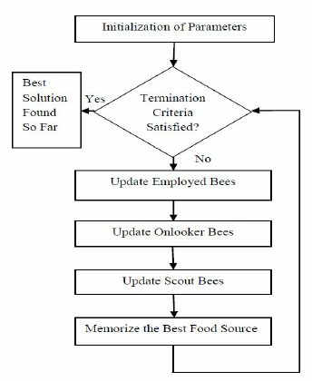

```{r setup, include=FALSE}
knitr::opts_chunk$set(echo = FALSE, message=FALSE, warning=FALSE, cache=TRUE, dev.args=list(bg=grey(0.9), pointsize=11), fig.height = 7, fig.width = 7)
library(tidyverse)
# library(ggforce)
library(gridExtra)
```

# Artificial Bee Colony (ABC) 

## Phases


```{r ABC, fig.cap = "Phases of ABC. Source: Kumar, S. et al. (2014)", out.width="50%"}

```


## Initialization

```r
 1. Data
 2. Generate the initial solution
 3. Evaluate the nectar (fitness)

```

Parameters:

 - The number of initial food sources $SN$

Simulation:

 - Initial solution input  
 - Initial food sources


## Employed bees


```r
 4. While (Condition not met){
 5. For each employed bee{
     Produce new solution 
     Greedy selection }

```

### Finding neighbour

$$\nu_{ij} = z_{ij} + \phi_{ij}(z_{ij}-z_{kj})$$

## Employed bees


```r
 4. While (Condition not met){
 5. For each employed bee{
     Produce new solution 
     Greedy selection }

```

### Calculate fitness

$$fit_i = \frac{1}{1/f_i}$$


## Onlooker bees


```r
 6. Calculate the probabilities of solution
 7. For each onlooker bee{  
     Select a solution using probabilities
     Produce new solution
     Greedy selection }
          
```

### Calculate probabilities

$$p_i = \frac{fit_i}{\sum^{SN}_{i=1} fit_i}$$


## Scout bees

```r
 8. Abandon non-improving solution 
 9. Replace it with new solution
```
Parameter:

- The limit

\pause

### Finding new solution

$$z_i^j = z_{min}^j + \delta_i^j(z_{max}^j-z_{min}^j)$$


## Stopping criteria

```r
10. Record the best solution }
11. End

```

Parameters:

 - Maximum number of iterations
 - Maximum number of unimproved global minimum

## Intensification vs Diversification

### Local search

Creat new solution from neighbours

 - The employed bee
 - The onlooker bee (with tendency)
 
\pause

### Global search

Replace current solution using new solution found from solution space

 - Abandon scheme
 - The scout bee


# Comparison

## Escaping local optim

Simulated annealing:

 - Being able to accept worse solution based on temperature

\pause

ABC:

 - Abandon solution that does not improve for many iteraions (combined with global search)


## Reproduction


\begin{columns}
\begin{column}{0.48\textwidth}

Genetic Algorithm:
\begin{itemize}
\item Selection
\item Crossover
\item Mutation
\item Evaluation
\item Update
\end{itemize}
\end{column}
\begin{column}{0.48\textwidth}

\pause

Each bee in ABC:
\begin{itemize}
\item Finding neighbour
\item Creat new solution
\item (Randomly)
\item Calculate fitness
\item Greedily select
\end{itemize}

\end{column}
\end{columns}


# Clustering

## Adjustment

### Solution representation: 
  
  $k\times D$ matrix \pause  $\ \ \Rightarrow$ vector
  
  \pause

### Standardization

  $z^*_{ij} = \frac{z_{ij}}{\max_{j}|z_{ij}|}$

\pause

### Initialize different foods sources

 - Evenly assigned across the solution space $\times$
 - Randomly sample between bounds $\times$
 \pause
 - Sample from the existing data points

## Constraint and Relexation

Minimum cluster size: $\frac{n}{2d}$

Too hard to find a solution so we:

 - Simulate initial input solution up to 4000 times
 - Initialize food sources up to 2500 times
 - Globally search in the scout bee up to 2000 times
 
\pause

Minimum cluster size is relaxed to $\frac{n}{10d}$ if the algorithm reaches the first two condition
 
## Result 1

```{r, fig.align = "center", out.width = "70%"}
tes_names <- dir("../test")
tes_k <- sub("_.*", "", tes_names) %>% 
  as.numeric()

stan <- function(x){
  max_x <- apply(x, 2, function(x) max(abs(x)))
  out <- mapply(function(x, max_x) x/max_x, x=as.data.frame(x), max_x = max_x)
  return(out)
}

plot_cluster <- function(data, alloc, k, par){
  if(NCOL(data)!=2) stop("high dimension")
  data <- as.matrix(stan(data))
  # qplot(x=data[,1], y= data[,2])
  ggplot() +
    geom_point(mapping =  aes(x=data[,1], y=data[,2],color = as.factor(alloc))) +
    geom_point(aes(x=par[1:k], y=par[(k+1):(2*k)]), size=2)  +
    theme(axis.title = element_blank(), legend.position = "none",
        plot.background=element_rect(fill = '#FAFAFA', colour = '#FAFAFA'))
}


test <- lapply(paste0("../test/",tes_names), read_csv, col_names = F)
plotdata <- readRDS("../test_plotdata.rds")
plot_test <- function(index){
  plot_cluster(data = test[[index]], alloc = plotdata[[index]]$alloc, k = length(plotdata[[index]]$par)/2, par = plotdata[[index]]$par)
}
## ---- p3 ----
plot_test(3)
```


## Result 2


```{r, fig.align = "center", out.width = "70%"}
## ---- p4 ----
plot_test(4)
```


## References {.allowframebreaks}

Kumar, S., Sharma, V. K., & Kumari, R. (2014). Randomized memetic artificial bee colony algorithm. arXiv preprint arXiv:1408.0102.